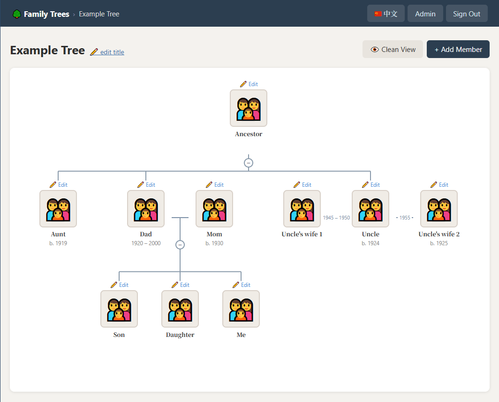

# Family Tree Website

A self-hosted, lightweight, two-language family tree manager built with PHP, JavaScript, and SQLite.
No external dependencies — everything runs from a files on your web server.



The code has been at least partially authored by Claude and Copilot.

## Issues & contributing

If you find any bugs, please consider contributing.
Otherwise, you can file an issue.

Feature requests will be considered, but priority is for the maintainer's own use case.
Please open an issue for discussion before contributing feature requests.
It's meant to be small and lightweight, so it's not meant to be overly featured.

## Requirements

| Requirement | Notes |
|---|---|
| PHP | 8.1 or newer |
| `pdo_sqlite` | database access |
| `sqlite3` | bundled with PHP, no separate install needed |
| `mbstring` | UTF-8 text handling |
| `gd` | image conversion (all uploads are saved as JPG) |
| Web server | (Optional if using it locally only) Apache 2.4+ with `mod_rewrite` for `.htaccess` support, or any server that runs PHP |

## Installation

### 0. Dependencies setup

1. Ensure PHP is installed with the correct settings in the `php.ini`.
2. Make sure `AllowOverride All` (or at least `AllowOverride FileInfo Options`) is set for your document root in Apache's config.

### 1. Upload the files

Upload the entire `family-tree/` folder (or its contents) to your web server via FTP, SFTP, or your hosting control panel.

Example destination if your subdomain is `family.example.com`:

```
/home/youraccount/public_html/family/
```

### 2. Set permissions

The web server process needs write access to the directory so it can create `family_tree.db` and the `uploads/` folder.

```bash
chmod 755 /path/to/family-tree
chmod 644 /path/to/family-tree/*.php
chmod 644 /path/to/family-tree/*.js
chmod 644 /path/to/family-tree/*.css
```

If the DB or uploads folder don't appear after the first visit, try:

```bash
chmod 775 /path/to/family-tree
```

### 3. Set initial password

This is only needed for the **first run** — the password is hashed and stored in the database on first visit.
You can do the first run [locally](#local-development-optional), then upload the `family_tree.db` along with the other files.

Before the first visit, set the environment variable with the initial password you want to use:

**Apache (`.htaccess` or virtual-host config):**

```apache
SetEnv FT_ADMIN_PASSWORD "your-admin-password"
```

**PHP built-in server (shell):**

```bash
# Linux / macOS
export FT_ADMIN_PASSWORD="your-admin-password"

# Windows (PowerShell)
$env:FT_ADMIN_PASSWORD = "your-admin-password"
```

After that, you can remove the environment variable and change passwords from the admin page.

### 4. Visit the site

Open `https://family.example.com/` (or whatever URL maps to your folder) in a browser.

The SQLite database and `uploads/` directory are created automatically on the first request.

---

## Local development

If you want to test locally:

### Dependencies

Ensure you have [PHP](https://www.php.net/downloads.php) installed.

Ensure your `php.ini` file has the following uncommented or added:

```plain
extension=pdo_sqlite
extension=sqlite3
extension=mbstring
extension=gd
```

In your terminal:

```bash
cd /path/to/family-tree
php -S localhost:8080 -t public includes/routes.php
```

Then open <http://localhost:8080/> in your browser.

> **Note:** The `.htaccess` file is Apache-specific and is ignored by the built-in server. The app still works; you just won't have the extra access protection locally.

## Usage notes

- "👁️ Clean View" button hides interactable elements (such as "Edit" links) so that you can take a nicer looking screenshot.
- Children of a couple are automatically attributed to the couple (they appear below both parents together). If a parent has multiple spouses, children may show up incorrectly unless the second parent is specified in the relationships.
- Why is there a "cousin" relationship, but no other non-hierarchical ones? Because it's common for someone to be related to the family, but without knowing how. You can also have family members listed without any relationships.

### Photos

- Accepted formats: **JPG, PNG, GIF, WebP**
- Maximum file size: **5 MB**
- Photos are converted to JPG, stored in `uploads/` and renamed to `{AlphanumericName}_{8hex}.ext`
- If no photo is uploaded, a 👪 placeholder is shown.

## Backup

To back up data, download:

1. `family_tree.db` — the database (all trees, members, relationships)
2. The `uploads/` folder — all member photos

Restore by uploading them to the same paths on a new server.

## Testing

### Unit tests (Pest)

Unit tests use [Pest](https://pestphp.com/) to cover pure helper functions (input sanitisation, year validation, HTML escaping, redirect safety).

```bash
composer install
vendor/bin/pest
```

On Windows:
```bash
php vendor\bin\pest
```

### End-to-end tests (Playwright)

E2E tests use [Playwright](https://playwright.dev/) to exercise all core flows in a real browser: authentication, tree/member CRUD, photo uploads, tree visualization, spouse year editing, language toggle, and navigation.

```bash
npm install
npx playwright install firefox --with-deps
npm test
```

Playwright automatically starts a PHP dev server on port 8081 with a fresh database for each run. To see the tests in a browser:

```bash
npm test -- --headed
```

To run a specific test file:

```bash
npm test -- tests/E2E/auth.spec.js
```
